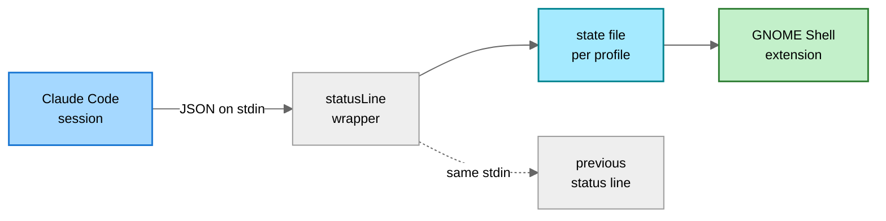

<h1 align="center">
	gnome-claude-usage
</h1>

<p align="center">
	Claude Code rate limit usage in the GNOME top panel, with one entry per
	<code>CLAUDE_CONFIG_DIR</code> profile.
</p>

## Why

Claude Code only shows how much of a rate limit window is spent from inside a
session. The number that tells you not to start the next long run is the one you
see last.

There is no local file with those percentages and no `claude usage` subcommand.
The only place they surface is the payload Claude Code hands to a custom status
line, so this extension stores that payload and puts it in the panel.

## Features

- Percentage and reset countdown for every rate limit window Claude Code reports
- Multiple profiles, one per `CLAUDE_CONFIG_DIR`, each with its own account,
  detected from `~/.claude*` on first run
- Plan shown per profile (`Max 5x`, `Pro`), read from what Claude Code stored
- Per-profile data age, so a stale number is never shown as a current one
- Installs and removes its own status line hook, chaining any existing one
- Optional live fetch between sessions, off by default; without it there is no
  network access at all

## How it works

`statusLine` runs on every status line render with a JSON payload on stdin:

```jsonc
{
	"model": { "display_name": "Opus 5" },
	"context_window": { "used_percentage": 61.4 },
	"cost": { "total_cost_usd": 4.12 },
	"rate_limits": {
		"five_hour": { "used_percentage": 43.2, "resets_at": 1787800000 },
		"seven_day": { "used_percentage": 68.0, "resets_at": 1787842120 },
		"seven_day_opus": { "used_percentage": 22.0, "resets_at": 1787842120 }
	}
}
```

A wrapper stores it verbatim and passes the same stdin on to whatever status
line was configured before. The extension only reads those files.



The payload arrives only while a session renders its status line, so numbers age
between sessions. Every profile carries the age of its data and dims once it
passes the stale threshold.

### Live fetch, off by default

**Fetch live usage between sessions** in the preferences calls
`GET https://api.anthropic.com/api/oauth/usage`, the endpoint Claude Code's
`/usage` uses, with the access token Claude Code stored in
`.credentials.json`. It runs only for a profile whose status line data is older
than the fetch interval, and writes the answer into the same state file the
wrapper writes, so everything downstream stays one code path.

The token is used as found and **never refreshed** by the extension: refreshing
rotates the refresh token, and a second client doing that races the running
Claude Code session. An expired token shows as `token expired` in the popup
until Claude Code renews it, which it does on its next run.

### Plan and profile discovery

`.credentials.json` also carries the subscription (`subscriptionType`,
`rateLimitTier`), shown in each profile's header as `Max 5x` or `Pro`. On first
enable, every `~/.claude*` directory holding a login is added as a profile;
the search button in the preferences repeats that for directories added later.

## Interface

**Panel**

```
┌─────────────────────────────────────────────────────────────────┐
│  Activities             27 Aug  12:04              ✳ 43%    ⏻   │
└─────────────────────────────────────────────────────────────────┘

  ✳ 43%        normal
  ✳ 91%        above the critical threshold, red
  ✳ 43% · 9%   two profiles, "All profiles side by side"
  ✳ 43%        stale, dimmed
  ✳ --         no profile has reported yet
```

**Popup**

```
╭──────────────────────────────────────────────────────────────────╮
│  work · Opus 5 · Max 5x                                    now   │
│                                                                  │
│    Current session   ████████░░░░░░░░░░░░░   43% used   2 h 11 m │
│                                                                  │
│    Weekly limits                                                 │
│    All models        ██████████████░░░░░░░   68% used   4 d 03 h │
│    Fable             ████░░░░░░░░░░░░░░░░░   22% used   4 d 03 h │
├──────────────────────────────────────────────────────────────────┤
│  personal · Sonnet 5 · Pro                            3 h ago    │
│                                                                  │
│    Current session   ██░░░░░░░░░░░░░░░░░░░    9% used   0 h 48 m │
│                                                                  │
│    Weekly limits                                                 │
│    All models        █████░░░░░░░░░░░░░░░░   24% used   2 d 17 h │
├──────────────────────────────────────────────────────────────────┤
│  demo · Opus 5                                             now   │
│    No rate limits reported yet                                   │
├──────────────────────────────────────────────────────────────────┤
│  archive                                              no data    │
│    Status line hook not installed                                │
├──────────────────────────────────────────────────────────────────┤
│  Settings...                                                     │
╰──────────────────────────────────────────────────────────────────╯
```

**Preferences, Profiles**

```
╭─ Claude Usage ───────────────────────────────────────── - □ x ─╮
│                 [ Profiles ]      Panel                        │
├────────────────────────────────────────────────────────────────┤
│                                                                │
│   PROFILES                                                 +   │
│   One entry per Claude Code config directory, the value        │
│   CLAUDE_CONFIG_DIR would be set to.                           │
│  ╭──────────────────────────────────────────────────────────╮  │
│  │ claude                       [ Remove hook ]  (O )  [x]  │  │
│  │ ~/.claude · hook in settings.json                        │  │
│  ├──────────────────────────────────────────────────────────┤  │
│  │ claude-work                  [ Install hook ] (O )  [x]  │  │
│  │ ~/.claude-work · no hook, settings.local.json sets its   │  │
│  │ own status line                                          │  │
│  ├──────────────────────────────────────────────────────────┤  │
│  │ claude-demo                  [ Install hook ] ( O)  [x]  │  │
│  │ ~/.claude-demo · no hook                                 │  │
│  ╰──────────────────────────────────────────────────────────╯  │
╰────────────────────────────────────────────────────────────────╯
```

**Preferences, Panel**

```
╭─ Claude Usage ───────────────────────────────────────── - □ x ─╮
│                  Profiles     [ Panel ]                        │
├────────────────────────────────────────────────────────────────┤
│                                                                │
│   PANEL                                                        │
│  ╭──────────────────────────────────────────────────────────╮  │
│  │  Show          ( Closest to its limit                ▾ ) │  │
│  │                  Most recently active                    │  │
│  │                  All profiles side by side               │  │
│  │                  Only claude                             │  │
│  │                  Only claude-work                        │  │
│  ├──────────────────────────────────────────────────────────┤  │
│  │  Limit         ( 5 hour window                       ▾ ) │  │
│  │  Hide without fresh data                       [ ━━○ ]   │  │
│  ╰──────────────────────────────────────────────────────────╯  │
│                                                                │
│   THRESHOLDS                                                   │
│  ╭──────────────────────────────────────────────────────────╮  │
│  │  Warning                                   [  70  ] ▲▼   │  │
│  │  Critical                                  [  90  ] ▲▼   │  │
│  │  Notify on crossing                            [ ●━━ ]   │  │
│  ╰──────────────────────────────────────────────────────────╯  │
│                                                                │
│   TIMING                                                       │
│  ╭──────────────────────────────────────────────────────────╮  │
│  │  Refresh interval   seconds                [  30  ] ▲▼   │  │
│  │  Data is stale after   minutes             [  60  ] ▲▼   │  │
│  ╰──────────────────────────────────────────────────────────╯  │
╰────────────────────────────────────────────────────────────────╯
```

## Install

```sh
git clone https://github.com/xseman/gnome-claude-usage
cd gnome-claude-usage
bun install
bun run build
./install.sh
```

`bun run build` compiles `src/*.ts` and assembles `lib/` into a complete
extension. `install.sh` copies that to
`~/.local/share/gnome-shell/extensions/claude-usage@xseman.github.io` (override
with `EXT_DIR=...`). It never edits a Claude Code config.

Wayland cannot reload the shell in place, so log out and back in, then:

```sh
gnome-extensions enable claude-usage@xseman.github.io
gnome-extensions prefs claude-usage@xseman.github.io
```

## Configuration

Add one profile per config directory and press **Install hook**.

### Where the hook goes

Claude Code merges several settings sources, and within a config directory
`settings.local.json` outranks `settings.json`. Writing to the lower file while
the higher one defines a status line would install a hook that silently never
runs, so the wrapper goes into **whichever file already defines a status line**,
and into `settings.json` when neither does.

Nothing is ever overwritten. Before writing, the existing command is read and
kept as `CLAUDE_USAGE_CHAIN`, the original file is copied to
`<name>.bak-claude-usage`, and only the `statusLine` key is touched:

```jsonc
{
	"statusLine": {
		"type": "command",
		"command": "CLAUDE_USAGE_DIR='/home/me/.claude' CLAUDE_USAGE_CHAIN='~/.claude/status-line.sh' gjs -m '/home/me/.local/share/gnome-shell/extensions/claude-usage@xseman.github.io/bin/claude-usage-statusline.js'"
	}
}
```

The chained command keeps receiving the same stdin, so an existing status line
goes on working. Each profile row says which file holds the hook, or which file
already has a status line of its own; the button's tooltip spells out what
pressing it will do. **Remove hook** restores the recorded command in the file
it was written to.

Claude Code watches its settings, so a running session picks the hook up without
a restart, and installing twice is a no-op.

Setting the command by hand works too. `CLAUDE_USAGE_DIR` must be the config
directory the profile represents; without it the wrapper falls back to
`$CLAUDE_CONFIG_DIR`, then `~/.claude`.

### State files

One file per profile, named after the config directory with slashes turned into
dashes and existing dashes doubled:

| Config directory        | State file                    |
| ----------------------- | ----------------------------- |
| `/home/me/.claude`      | `-home-me-.claude.json`       |
| `/home/me/.claude-work` | `-home-me-.claude--work.json` |
| `/home/me/.claude/work` | `-home-me-.claude-work.json`  |

Doubling the dashes is what keeps the last two apart. Claude Code's own project
slugs skip that step and would map both to the same name.

## Requirements

- **GNOME Shell 48 or newer.** Developed against 50.
- **Claude Code** on a subscription plan. API key users have no rate limit
  windows to report.
- Nothing beyond GNOME's own `gjs`, which runs both the extension and the
  status line wrapper. No `jq`, no `python`.
- **Bun and TypeScript to build.** Nothing beyond GJS is needed to run the
  built extension.

## Notes & limitations

- **Rate limits are account wide**, so concurrent sessions in one profile report
  the same numbers and the most recent write wins.
- **`session-modes` is `user` only**, so the indicator is hidden on the lock
  screen.
- **The extension polls instead of using `Gio.FileMonitor`.** File monitors need
  an inotify instance, and those are capped per user by
  `fs.inotify.max_user_instances` (128 by default). A desktop full of editors and
  language servers exhausts that routinely, and once it does `monitor_directory`
  fails with _"Unable to find default local file monitor type"_ for every GIO
  client while `monitor_file` degrades to polling anyway. Stating a handful of
  small files on the timer the countdowns already need cannot fail that way.

## Development

```sh
bun run typecheck   # tsc --noEmit, strict
bun run build       # src/*.ts -> lib/
bun run test        # builds, then runs the suites under gjs
bun run fmt
shellcheck build.sh install.sh pack.sh test/run.sh
```

### Reloading an installed copy

`bun run build && ./install.sh` replaces the files, but what it takes to pick
them up differs per file:

| Changed                          | To apply                                     |
| -------------------------------- | -------------------------------------------- |
| `prefs.js`                       | Close the preferences window and reopen it   |
| `bin/claude-usage-statusline.js` | Nothing, Claude Code runs it on every render |
| Anything else                    | Log out and back in                          |

GNOME Shell imports `extension.js` once per session and caches the module, so
`gnome-extensions disable`/`enable` re-runs `enable()` against the old code. With
a changed `metadata.json` version it refuses outright: _"A different version was
loaded previously. You need to log out for changes to take effect."_ On Xorg,
Alt+F2 `r` restarts the shell in place; Wayland has no equivalent.

The preferences dialog runs in the separate `org.gnome.Shell.Extensions` D-Bus
service, which quits when idle, so reopening the window usually reloads it. To
be certain:

```sh
pkill -f "gjs -m /usr/share/gnome-shell/org.gnome.Shell.Extensions"
```

To try a build without logging out, run a nested shell. It picks up the
installed extension and leaves the session alone. GNOME 50 calls this
`--devkit`; `--wayland` without `--display-server` does the same:

```sh
dbus-run-session -- gnome-shell --devkit
```

Headless, for a load check in a script:

```sh
G_MESSAGES_DEBUG=all dbus-run-session -- \
    gnome-shell --headless --virtual-monitor 1280x720 2>&1 |
    grep claude-usage
```

`src/` holds the TypeScript sources, `lib/` the built extension, `test/` suites
that run under plain `gjs` against `lib/`. Running without GNOME Shell
constrains what may import what. See [AGENTS.md](AGENTS.md).

```sh
journalctl -f -o cat /usr/bin/gnome-shell
```

## Releasing

`bun run pack` builds `dist/<uuid>.shell-extension.zip`, the bundle
extensions.gnome.org takes: every file at the archive root, the schema as XML
only. It is a plain `zip` rather than `gnome-extensions pack`, which ships in
the gnome-shell package and would mean installing all of GNOME in CI to produce
a 20 kB archive.

Releases follow release-please. Conventional commits on `master` open a release
PR; merging it tags the version, writes the changelog, bumps `version-name` in
`metadata.json` and attaches the zip to the GitHub release.

That attached zip is the artifact. extensions.gnome.org has no upload API, so
the last step is manual and takes about a minute:

1. Download the zip from the release page
2. Upload it at <https://extensions.gnome.org/upload/> and accept the two terms
3. Review is by a human and takes days to weeks; the result arrives by e-mail

Before uploading, run their static analyzer:

```sh
pip install -U shexli
shexli dist/*.shell-extension.zip
```

## License

GPL-2.0-or-later, see [LICENSE](LICENSE). GNOME Shell is GPL-2.0-or-later and
extensions.gnome.org requires compatible terms.

Unofficial: not affiliated with Anthropic. The panel icon is Anthropic's Claude
mark, taken from [claude-status](https://github.com/montanhes/claude-status).
extensions.gnome.org requires permission for third party logos, so a submission
there needs either that permission or an original icon.

## Related

Other GNOME extensions for the same numbers, each with a different data source:

- [claude-status](https://github.com/montanhes/claude-status) runs
  `claude -p /usage` on a timer; also the source of the icon here
- [claude-quota](https://github.com/andrearicchi/gnome-shell-extension-claude-quota)
  polls the OAuth endpoint with the stored token, never refreshing it; the
  model the live fetch here follows
- [ClaudeCodeUsage](https://github.com/dvdstelt/ClaudeCodeUsage) polls and
  refreshes the token itself, shows the plan, projects burn rate; the source of
  the plan label and profile discovery here
- [claudeland](https://github.com/FabioSM46/claudeland) adds a desktop card

- <https://code.claude.com/docs/en/statusline>
- <https://gjs.guide/extensions/>
