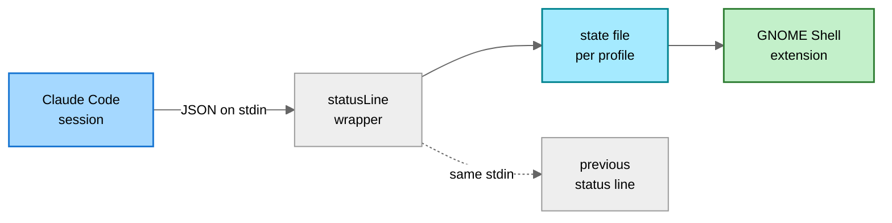

<h1 align="center">
	gnome-claude-usage
</h1>

<p align="center">
	Claude Code rate limit usage in the GNOME top panel, with one entry per
	<code>CLAUDE_CONFIG_DIR</code> profile.
</p>

## Why

Claude Code only shows how much of a rate limit window is spent from inside a
session. The number that tells you not to start the next long run is the one you
see last.

There is no local file with those percentages and no `claude usage` subcommand.
The only place they surface is the payload Claude Code hands to a custom status
line, so this extension stores that payload and puts it in the panel.

## Features

- Percentage and reset countdown for every rate limit window Claude Code reports
- Multiple profiles, one per `CLAUDE_CONFIG_DIR`, each with its own account
- Per-profile data age, so a stale number is never shown as a current one
- Installs and removes its own status line hook, chaining any existing one
- No network access, no credential reads, no transcript parsing

## How it works

`statusLine` runs on every status line render with a JSON payload on stdin:

```jsonc
{
	"model": { "display_name": "Opus 5" },
	"context_window": { "used_percentage": 61.4 },
	"cost": { "total_cost_usd": 4.12 },
	"rate_limits": {
		"five_hour": { "used_percentage": 43.2, "resets_at": 1787800000 },
		"seven_day": { "used_percentage": 68.0, "resets_at": 1787842120 },
		"seven_day_opus": { "used_percentage": 22.0, "resets_at": 1787842120 }
	}
}
```

A wrapper stores it verbatim and passes the same stdin on to whatever status
line was configured before. The extension only reads those files.



The payload arrives only while a session renders its status line, so numbers age
between sessions. Every profile carries the age of its data and dims once it
passes the stale threshold.

`/api/oauth/usage` would give the same numbers without a session, but Claude
Code rotates the OAuth token when it calls it. A second client racing that
rotation can log you out, so the extension stays away from it.

## Interface

**Panel**

```
┌─────────────────────────────────────────────────────────────────┐
│  Activities             27 Aug  12:04              ◕ 43%    ⏻   │
└─────────────────────────────────────────────────────────────────┘

  ◔ 43%        normal
  ◕ 91%        above the critical threshold
  ◐ 43% · 9%   two profiles, "All profiles side by side"
  ◌ 43%        stale, dimmed
  ◌ --         no data, hook not installed
```

**Popup**

```
╭────────────────────────────────────────────────────────────╮
│  work · Opus 5                                       now   │
│                                                            │
│    5 h        ████████░░░░░░░░░░░░░   43 %    2 h 11 m     │
│    7 d        ██████████████░░░░░░░   68 %    4 d 03 h     │
│    7 d Opus   ████░░░░░░░░░░░░░░░░░   22 %    4 d 03 h     │
│                                                            │
│    context 61 %  ·  $4.12  ·  demo-web                     │
├────────────────────────────────────────────────────────────┤
│  personal · Sonnet 5                            3 h ago    │
│                                                            │
│    5 h        ██░░░░░░░░░░░░░░░░░░░    9 %    0 h 48 m     │
│    7 d        █████░░░░░░░░░░░░░░░░   24 %    2 d 17 h     │
├────────────────────────────────────────────────────────────┤
│  archive                                        no data    │
│    Status line hook not installed                          │
├────────────────────────────────────────────────────────────┤
│  Settings...                                               │
╰────────────────────────────────────────────────────────────╯
```

**Preferences, Profiles**

```
╭─ Claude Usage ───────────────────────────────────────── - □ x ─╮
│            [ Profiles ]   Panel   Advanced                     │
├────────────────────────────────────────────────────────────────┤
│                                                                │
│   PROFILES                                                 +   │
│  ╭──────────────────────────────────────────────────────────╮  │
│  │ work                                         [ ●━━ ]  ▾  │  │
│  │ ~/.claude · hook installed                               │  │
│  ├──────────────────────────────────────────────────────────┤  │
│  │   Name              [ work                          ]    │  │
│  │   Config directory  [ /home/me/.claude              ]    │  │
│  │                                                          │  │
│  │   Status line hook                      ┌─────────────┐  │  │
│  │   Installed, chaining ~/.claude/....sh  │   Remove    │  │  │
│  │                                         └─────────────┘  │  │
│  │                                                          │  │
│  │   Remove profile                                    Del  │  │
│  ├──────────────────────────────────────────────────────────┤  │
│  │ personal                                     [ ●━━ ]  ▸  │  │
│  │ ~/.claude-personal · hook installed                      │  │
│  ├──────────────────────────────────────────────────────────┤  │
│  │ archive                                      [ ━━○ ]  ▸  │  │
│  │ ~/.claude-archive · hook missing                         │  │
│  ╰──────────────────────────────────────────────────────────╯  │
╰────────────────────────────────────────────────────────────────╯
```

**Preferences, Panel**

```
╭─ Claude Usage ───────────────────────────────────────── - □ x ─╮
│              Profiles   [ Panel ]   Advanced                   │
├────────────────────────────────────────────────────────────────┤
│                                                                │
│   PANEL                                                        │
│  ╭──────────────────────────────────────────────────────────╮  │
│  │  Show          ( Closest to its limit                ▾ ) │  │
│  │                  Most recently active                    │  │
│  │                  A specific profile                      │  │
│  │                  All profiles side by side               │  │
│  ├──────────────────────────────────────────────────────────┤  │
│  │  Limit         ( 5 hour window                       ▾ ) │  │
│  │  Contents      ( Icon and percentage                 ▾ ) │  │
│  │  Hide without fresh data                       [ ━━○ ]   │  │
│  ╰──────────────────────────────────────────────────────────╯  │
│                                                                │
│   THRESHOLDS                                                   │
│  ╭──────────────────────────────────────────────────────────╮  │
│  │  Warning                                   [  70  ] ▲▼   │  │
│  │  Critical                                  [  90  ] ▲▼   │  │
│  │  Notify on crossing                            [ ●━━ ]   │  │
│  ╰──────────────────────────────────────────────────────────╯  │
╰────────────────────────────────────────────────────────────────╯
```

## Install

```sh
git clone https://github.com/xseman/gnome-claude-usage
cd gnome-claude-usage
bun install
bun run build
./install.sh
```

`bun run build` compiles `src/*.ts` and assembles `lib/` into a complete
extension. `install.sh` copies that to
`~/.local/share/gnome-shell/extensions/claude-usage@xseman.github.io` (override
with `EXT_DIR=...`). It never edits a Claude Code config.

Wayland cannot reload the shell in place, so log out and back in, then:

```sh
gnome-extensions enable claude-usage@xseman.github.io
gnome-extensions prefs claude-usage@xseman.github.io
```

## Configuration

Add one profile per config directory and press **Install** on its status line
hook. That rewrites only the `statusLine` key of that profile's `settings.json`,
after copying the original to `settings.json.bak-claude-usage`:

```jsonc
{
	"statusLine": {
		"type": "command",
		"command": "CLAUDE_USAGE_DIR='/home/me/.claude' CLAUDE_USAGE_CHAIN='~/.claude/status-line.sh' '/home/me/.local/share/gnome-shell/extensions/claude-usage@xseman.github.io/bin/claude-usage-statusline'"
	}
}
```

`CLAUDE_USAGE_CHAIN` keeps receiving the same stdin, so an existing status line
goes on working. **Remove** puts it back. Claude Code watches `settings.json`,
so a running session picks the hook up without a restart, and installing twice
is a no-op.

Setting the command by hand works too. `CLAUDE_USAGE_DIR` must be the config
directory the profile represents; without it the wrapper falls back to
`$CLAUDE_CONFIG_DIR`, then `~/.claude`.

### State files

One file per profile, named after the config directory with slashes turned into
dashes and existing dashes doubled:

| Config directory        | State file                    |
| ----------------------- | ----------------------------- |
| `/home/me/.claude`      | `-home-me-.claude.json`       |
| `/home/me/.claude-work` | `-home-me-.claude--work.json` |
| `/home/me/.claude/work` | `-home-me-.claude-work.json`  |

Doubling the dashes is what keeps the last two apart. Claude Code's own project
slugs skip that step and would map both to the same name.

## Requirements

- **GNOME Shell 48 or newer.** Developed against 50.
- **Claude Code** on a subscription plan. API key users have no rate limit
  windows to report.
- A **POSIX shell**. The wrapper needs nothing else, no `jq`, no `python`.
- **Bun and TypeScript to build.** Nothing beyond GJS is needed to run the
  built extension.

## Notes & limitations

- **Rate limits are account wide**, so concurrent sessions in one profile report
  the same numbers and the most recent write wins.
- **The cost figure is per session**, not a daily total, which is why it sits in
  the footer rather than next to the limits.
- **`session-modes` is `user` only**, so the indicator is hidden on the lock
  screen.
- **The extension polls instead of using `Gio.FileMonitor`.** On Fedora 44 with
  glib2 2.88, `monitor_directory` fails with _"Unable to find default local file
  monitor type"_ for every GIO client, and `monitor_file` degrades to
  `GPollFileMonitor` anyway. Reading a few small files on the timer the
  countdowns already need is one code path fewer.

## Development

```sh
bun run typecheck   # tsc --noEmit, strict
bun run build       # src/*.ts -> lib/
bun run test        # builds, then runs the suites under gjs
bun run fmt
shellcheck bin/claude-usage-statusline build.sh install.sh test/run.sh
```

`src/` holds the TypeScript sources, `lib/` the built extension, `test/` suites
that run under plain `gjs` against `lib/`. Running without GNOME Shell
constrains what may import what. See [AGENTS.md](AGENTS.md).

```sh
journalctl -f -o cat /usr/bin/gnome-shell
```

## Related

- <https://code.claude.com/docs/en/statusline>
- <https://gjs.guide/extensions/>
