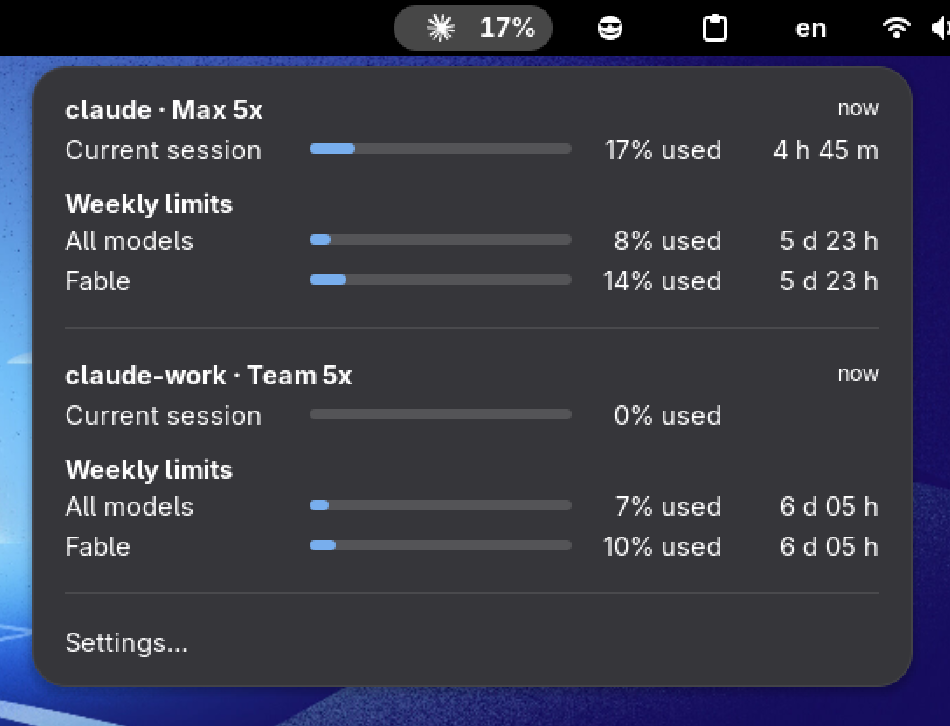

<h1 align="center">
	Claude Limits
</h1>

<p align="center">
	Claude Code rate limit usage in the GNOME top panel, one entry per
	<code>CLAUDE_CONFIG_DIR</code> profile.
</p>

<p align="center">
	
</p>

## Why

Claude Code shows how much of a rate limit window is spent only from inside a
session, in `/usage`. There is no local file with those numbers and no CLI
subcommand for them. The one place they leave the terminal is the payload
Claude Code hands to a custom status line, so this extension stores that
payload and puts it in the panel.

## Features

- Every rate limit window Claude Code reports, with percentage and reset countdown
- Multiple profiles, one per `CLAUDE_CONFIG_DIR`, detected from `~/.claude*`
- Plan per profile (`Max 5x`, `Pro`), read from what Claude Code stored
- Data age per profile, so a stale number never looks current
- Installs and removes its own status line hook, chaining any existing one
- Optional live fetch between sessions, off by default; without it there is no
  network access at all

## How it works

```
Claude Code session ──JSON on stdin──▶ statusLine wrapper (gjs)
                                          │            │
                                   writes │            │ same stdin
                                          ▼            ▼
                       ~/.local/state/claude-usage/<profile>.json   previous status line
                                          │
                                    reads │  on a timer
                                          ▼
                                 GNOME Shell extension ──▶ panel + popup
```

The wrapper stores the payload verbatim and hands the same stdin to whatever
status line was configured before. Nothing is parsed outside the extension,
and the shell process only ever reads a few small files.

Payloads arrive only while a session renders its status line, so numbers age
between sessions. **Fetch live usage between sessions** (preferences, off by
default) fills that gap by calling the endpoint `/usage` uses with the token
Claude Code stored. The token is never refreshed by the extension; an expired
one shows as `token expired` until Claude Code renews it.

## Install

```sh
git clone https://github.com/xseman/gnome-claude-usage
cd gnome-claude-usage
bun install && bun run build && ./install.sh
```

Log out and back in (Wayland cannot reload the shell), then:

```sh
gnome-extensions enable claude-limits@xseman.github.io
gnome-extensions prefs claude-limits@xseman.github.io
```

## Configuration

Add a profile per config directory and press **Install hook**. That writes a
`statusLine` entry into the profile's settings:

```jsonc
{
	"statusLine": {
		"type": "command",
		"command": "CLAUDE_USAGE_DIR='/home/me/.claude' CLAUDE_USAGE_CHAIN='<previous command>' gjs -m '<extension dir>/bin/claude-usage-statusline.js'"
	}
}
```

- The file is chosen by precedence: `settings.local.json` if it already sets a
  status line, else `settings.json`. A hook in the lower file would never run.
- An existing status line is kept as `CLAUDE_USAGE_CHAIN` and keeps receiving
  the same stdin. The original file is backed up as `<name>.bak-claude-usage`.
- **Remove hook** restores the previous command. Installing twice is a no-op.
- Claude Code watches its settings, so a running session picks the hook up
  without a restart.

## Requirements

- GNOME Shell 48 or newer, developed against 50
- Claude Code on a subscription plan; API key users have no rate limit windows
- Bun to build; nothing beyond GNOME's own `gjs` to run

## Development

```sh
bun run typecheck   # tsc --noEmit, strict
bun run test        # builds lib/, then runs the suites under plain gjs
bun run pack        # dist/<uuid>.shell-extension.zip for extensions.gnome.org
dbus-run-session -- gnome-shell --devkit   # try a build without logging out
```

After `bun run build && ./install.sh`, `prefs.js` changes apply on reopening the
window and the wrapper needs nothing. Everything else needs a logout: GNOME
Shell imports `extension.js` once per session and caches it.

Sources are TypeScript in `src/`, tests run against the built `lib/` without
GNOME Shell, which constrains what may import what. See [CLAUDE.md](CLAUDE.md).

## Releasing

Conventional commits on `master` open a release-please PR. Merging it tags the
version and attaches the zip to the GitHub release. extensions.gnome.org has no
upload API: download that zip and submit it at
<https://extensions.gnome.org/upload/>. `shexli dist/*.zip` runs their static
analyzer beforehand.

## License

GPL-2.0-or-later, see [LICENSE](LICENSE).

Unofficial, not affiliated with Anthropic. The panel icon is Anthropic's Claude
mark, taken from [claude-status](https://github.com/montanhes/claude-status);
extensions.gnome.org requires permission for third party logos.

## Related

- [claude-status](https://github.com/montanhes/claude-status) runs `claude -p /usage` on a timer
- [claude-quota](https://github.com/andrearicchi/gnome-shell-extension-claude-quota) polls the OAuth endpoint, never refreshing the token
- [ClaudeCodeUsage](https://github.com/dvdstelt/ClaudeCodeUsage) polls, refreshes the token, shows the plan
- <https://code.claude.com/docs/en/statusline>
- <https://gjs.guide/extensions/>
